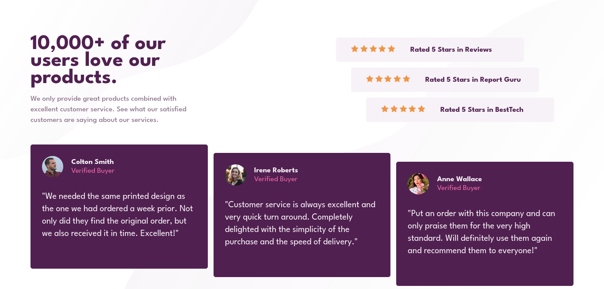

# Frontend Mentor - Social proof section solution

This is a solution to the [Social proof section challenge on Frontend Mentor](https://www.frontendmentor.io/challenges/social-proof-section-6e0qTv_bA). Frontend Mentor challenges help you improve your coding skills by building realistic projects.

## Table of contents

- [Overview](#overview)
  - [The challenge](#the-challenge)
  - [Screenshot](#screenshot)
  - [Links](#links)
- [My process](#my-process)
  - [Built with](#built-with)
  - [What I learned](#what-i-learned)
  - [Useful resources](#useful-resources)
- [Author](#author)
- [Acknowledgments](#acknowledgments)

## Overview

### The challenge

Users should be able to:

- View the optimal layout for the section depending on their device's screen size

### Screenshot

### Links

- Solution URL: [https://github.com/MayyarZidane/social-proof-section](https://github.com/MayyarZidane/social-proof-section)
- Live Site URL: [https://mayyarzidane.github.io/social-proof-section/](https://mayyarzidane.github.io/social-proof-section/)

## My process

### Built with

- Semantic HTML5 markup
- CSS custom properties
- Flexbox
- CSS Grid
- Mobile-first workflow
- rem & em units

### What I learned

- How to use em with:
  - margin, padding, width, height
- How to use rem with font size

### Useful resources

- [px to rem extension](https://marketplace.visualstudio.com/items?itemName=sainoba.px-to-rem) - This helped me for convert px to rem with just press alt + z

## Author

- Frontend Mentor - [@MayyarZidane](https://www.frontendmentor.io/profile/MayyarZidane)

## Acknowledgments

- I watched This course to enhance my code and learn tips and tracks: [https://www.youtube.com/watch?v=K27WULzr2P8](https://www.youtube.com/watch?v=K27WULzr2P8)
